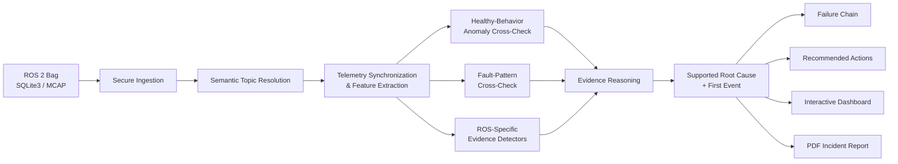

# RobotReplay

> **The Black Box Investigator for Autonomous Robots**

**Status:** Active development · **Current baseline:** v1.0.0 · **Stack:** ROS 2 Humble · Python 3.10 · SQLite3 / MCAP · Streamlit

RobotReplay is an incident-investigation platform for ROS 2 autonomous robots. It turns mission recordings into evidence-backed diagnoses that explain **what failed first, when it happened, how the failure propagated, which telemetry supports the conclusion, and what an engineer should inspect next**.

The project is being developed as a reusable robotics diagnostics platform, with ongoing work focused on broader robot compatibility, stronger external validation, automated regression testing, and fleet-oriented incident analysis.

## Why RobotReplay

ROS 2 systems can record enormous amounts of telemetry, but a rosbag is evidence, not an explanation.

When an autonomous robot fails, engineers may need to manually correlate localization estimates, TF, LiDAR, odometry, commanded motion, wheel feedback, and timestamps across multiple topics. RobotReplay reconstructs those signals into a structured incident investigation.

```text
ROS 2 recording
      ↓
Telemetry reconstruction
      ↓
Anomaly + fault-pattern cross-checks
      ↓
ROS-specific evidence reasoning
      ↓
Supported root cause + first event
      ↓
Failure propagation
      ↓
Engineering actions + incident report
```

## What RobotReplay Does

The current system provides:

- secure ROS 2 bag ingestion for SQLite3 and MCAP recordings,
- semantic topic resolution for compatible telemetry,
- synchronized telemetry feature extraction,
- healthy-behavior anomaly detection,
- fault-pattern statistical cross-checking,
- ROS-specific evidence detectors,
- capability-aware analysis when signals are missing,
- root-cause ranking and first-event reconstruction,
- failure-chain analysis,
- interactive telemetry visualization,
- recommended engineering checks,
- PDF Incident Investigation Reports,
- JSON and telemetry CSV exports,
- graceful abstention when evidence does not support a known diagnosis.

### Current diagnostic coverage

| Failure signature | Primary evidence |
|---|---|
| Localization Jump | AMCL discontinuity correlated with `map → odom` change |
| LiDAR Dropout | Scan staleness and observed scan gap |
| LiDAR Stream Integrity Failure | Timestamp disorder, repeated scans, and degraded scan usability |
| TF Delay / Discontinuity | Transform staleness, recovery behavior, and downstream frame evidence |
| Wheel / Encoder Direction Mismatch | Command-to-wheel behavior inconsistent with expected differential-drive response |

RobotReplay deliberately separates **abnormality detection** from **supported root-cause diagnosis**.

For unfamiliar or partial recordings, the system can return one of three outcomes:

1. **Supported diagnosis** — available evidence establishes an implemented failure signature.
2. **Abnormal behavior without a supported known signature** — the recording appears abnormal, but the evidence does not justify a known root cause.
3. **Insufficient compatible telemetry** — the signals required for a diagnostic capability are unavailable.

The statistical fault-pattern model also uses a feature-coverage gate and may abstain when a recording does not contain enough compatible features.

## Architecture



A statistical model can indicate that telemetry looks unusual. A supported diagnosis requires evidence grounded in robot behavior.

```text
Anomaly score ≠ diagnosis
Model probability ≠ evidence strength
Missing coverage → abstain
Unsupported signature → do not force a label
```

Ground-truth `/robotreplay/fault_event` markers are used only in controlled evaluation and are not used by the diagnosis or inference path.

For the detailed system design, see [docs/ARCHITECTURE.md](docs/ARCHITECTURE.md).

## Quick Start

### 1. Install

Validated baseline environment:

- ROS 2 Humble
- Python 3.10.12
- Linux x86_64

```bash
source /opt/ros/humble/setup.bash

python3 -m venv .venv
source .venv/bin/activate
source /opt/ros/humble/setup.bash

python3 -m pip install --upgrade pip
python3 -m pip install -r requirements.txt
python3 -m pip install -e . --no-deps
```

ROS Python modules such as `rclpy`, `rosbag2_py`, and `rosidl_runtime_py` are supplied by ROS 2 Humble.

See [docs/INSTALL.md](docs/INSTALL.md) for complete setup and verification.

### 2. Launch the dashboard

```bash
streamlit run dashboard/app.py
```

The investigation workflow is:

```text
Analyze Recording / Sample Incidents
        ↓
Incident Summary
        ↓
What Happened
        ↓
Evidence + Telemetry
        ↓
Failure Timeline
        ↓
Recommended Actions
        ↓
PDF Incident Investigation Report
```

### 3. Analyze from the CLI

```bash
robotreplay /path/to/ros2_bag_directory
```

or:

```bash
python3 -m robotreplay.analyze /path/to/ros2_bag_directory
```

## Reproducible Example

A compact ROS 2 localization-failure recording is included at:

```text
examples/localization_jump_rosbag.zip
```

Launch the dashboard, open **Analyze Recording**, upload the example, and run the analysis.

Expected result:

```text
Mission status:          ANOMALOUS
Most likely cause:       Localization Jump
First diagnostic event:  10.400 s
Evidence strength:       1.00
```

The **Sample Incidents** view also provides additional precomputed examples without requiring an upload.

## Evaluation

### Controlled recorded-mission regression

| Recording | Final result | First supported event |
|---|---|---:|
| `healthy_003` | HEALTHY — no supported fault detected | — |
| `localization_jump_001` | Localization Jump | 10.400 s |
| `lidar_dropout_001` | LiDAR Dropout | 60.600 s |
| `tf_delay_001` | TF Delay / Discontinuity | 60.600 s |
| `wheel_mismatch_001` | Wheel / Encoder Direction Mismatch | 60.200 s |

All five controlled recordings produced the expected outcome in the current baseline regression.

Measured diagnostic latency across the four controlled fault recordings:

- **Mean:** approximately 0.442 s
- **Maximum:** 0.600 s

### Fault-pattern benchmark

The supervised classifier achieved:

- **100% accuracy**
- **100% macro precision**
- **100% macro recall**
- **100% macro F1**
- **0% healthy false-positive rate**

on a **200-sample controlled held-out telemetry-augmentation benchmark** derived from held-out source mission `healthy_003`.

This is a scoped benchmark result and is **not** presented as production-world accuracy.

### Healthy-behavior anomaly layer

On unseen healthy mission `healthy_003`, approximately **0.73%** of synchronized windows were marked anomalous while the evidence reasoning returned **no supported fault signature**.

The LiDAR Stream Integrity Failure detector was also developed using public BCubed / ACOLYTE ROS 2 recordings; those results are treated as external development evidence rather than independent blind validation.

For methodology, detailed metrics, and limitations, see [docs/EVALUATION.md](docs/EVALUATION.md).

## Security

RobotReplay treats uploaded ROS 2 recordings as untrusted input.

The current ingestion layer includes archive traversal protection, symlink rejection, file-type allow-listing, archive/resource limits, ROS bag structural validation, and support for both SQLite3 and MCAP storage backends.

Current regression evidence:

- **9 / 9** input-security cases passing,
- **3 / 3** resource-security cases passing,
- valid SQLite3 upload: **PASS**,
- valid MCAP upload: **PASS**.

These results describe the implemented regression suite and are not a formal security certification.

See [SECURITY.md](SECURITY.md) for the security model and reporting guidance.

## Current Scope

RobotReplay does **not** claim arbitrary open-world diagnosis across every ROS 2 robot and subsystem.

The current system is focused on autonomous mobile-robot navigation and provides:

- general abnormal-behavior detection when telemetry is compatible,
- explainable diagnosis for five implemented evidence signatures,
- statistical cross-checks when feature coverage is sufficient,
- safe abstention when a known signature cannot be established,
- evidence-backed incident reports.

Broader production use requires validation across more robots, environments, sensor configurations, subsystems, and fault families.

## Development Roadmap

Near-term priorities:

- unknown-bag compatibility testing,
- stronger semantic topic mapping,
- Docker-based reproducible execution,
- automated CI and regression testing,
- independent public-dataset validation,
- additional navigation and system-health signatures,
- broader false-positive / false-negative analysis.

Longer-term directions include cross-robot telemetry normalization, open-set fault recognition, causal dependency graphs, incident retrieval, recurrence analysis, and fleet-level diagnostics.

See [ROADMAP.md](ROADMAP.md) for the full development plan.

## Project Layout

- `robotreplay/` — core analysis, ingestion, ML, and evidence reasoning
- `dashboard/` — interactive Streamlit application
- `evaluation/` — training, regression, and evaluation tooling
- `models/` — trained baseline models
- `examples/` — reproducible sample recording
- `docs/` — architecture, evaluation, and installation documentation
- `scripts/` — validation and release-engineering utilities

## Documentation

- [Architecture](docs/ARCHITECTURE.md)
- [Evaluation](docs/EVALUATION.md)
- [Installation](docs/INSTALL.md)
- [Security](SECURITY.md)
- [Roadmap](ROADMAP.md)

## Source Availability and Commercial Direction

This repository is public so that the engineering work, architecture, validation methodology, and implementation quality can be reviewed directly.

The source is **not released under an open-source license**. Copyright is retained by the author. See [LICENSE](LICENSE).

The public repository serves as the technical core. Future hosted, fleet-management, enterprise-integration, proprietary-data, and commercial analytics layers may be developed separately.

## Author

**Atharva Zadbuke**

GitHub: [atharva10764](https://github.com/atharva10764)

---

**RobotReplay is the incident-investigation layer between raw robot telemetry and engineering action.**
