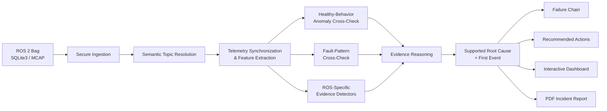

# RobotReplay

> **The Black Box Investigator for Autonomous Robots**

**Status: Active development**

RobotReplay is an incident-investigation platform for ROS 2 autonomous robots. It turns mission recordings into evidence-backed diagnoses that explain **what failed first, when it happened, how the failure propagated, which telemetry supports the conclusion, and what an engineer should inspect next**.

The project is being developed as a reusable robotics diagnostics platform rather than a one-off experiment. The current release establishes a validated navigation-diagnostics baseline while ongoing work focuses on broader robot compatibility, stronger external validation, automated testing, and fleet-oriented workflows.

## Why RobotReplay

ROS 2 systems already record enormous amounts of telemetry, but a rosbag is evidence, not an explanation.

When an autonomous robot fails, engineers often need to manually compare:

- localization estimates,
- TF updates,
- LiDAR streams,
- odometry,
- commanded motion,
- wheel or joint feedback,
- timestamps across multiple topics.

RobotReplay reconstructs these signals into a structured incident investigation.

```text
Raw ROS 2 recording
        ↓
Telemetry reconstruction
        ↓
Abnormal-behavior cross-checks
        ↓
ROS-specific evidence
        ↓
Supported root cause
        ↓
Failure propagation
        ↓
Engineering actions + incident report
```

## Current Capabilities

RobotReplay currently provides:

- Secure ROS 2 bag ingestion for SQLite3 and MCAP recordings
- Semantic topic resolution for compatible telemetry
- Synchronized feature extraction
- Healthy-behavior anomaly detection
- Fault-pattern statistical cross-checking
- ROS-specific evidence detectors
- Capability-aware analysis when signals are missing
- Root-cause ranking and first-event reconstruction
- Failure-chain / propagation analysis
- Interactive telemetry visualization
- Recommended engineering checks
- PDF Incident Investigation Reports
- JSON and telemetry CSV exports
- Graceful abstention when evidence does not support a known diagnosis

## Current Diagnostic Coverage

The current implementation contains five validated evidence signatures.

| Failure signature | Primary evidence |
|---|---|
| Localization Jump | AMCL discontinuity correlated with `map → odom` change |
| LiDAR Dropout | Scan staleness and observed scan gap |
| LiDAR Stream Integrity Failure | Timestamp disorder, repeated scans, and severely degraded scan usability |
| TF Delay / Discontinuity | Transform staleness, recovery behavior, and downstream frame evidence |
| Wheel / Encoder Direction Mismatch | Command-to-wheel behavior inconsistent with expected differential-drive response |

RobotReplay deliberately separates **abnormality detection** from **supported root-cause diagnosis**. If an incident is abnormal but does not match an implemented evidence signature, the system does not force it into a known class.

## Unknown Recordings and Abstention

RobotReplay is designed to degrade safely on unfamiliar recordings.

For a compatible ROS 2 bag, the ingestion layer first inspects available topics and message types, resolves supported semantic roles, and determines which diagnostic capabilities are available.

Possible outcomes are:

1. **Supported diagnosis** — available evidence establishes an implemented failure signature.
2. **Abnormal behavior without a supported known signature** — the recording appears abnormal, but the evidence layer does not justify a known root cause.
3. **Insufficient compatible telemetry** — the required signals for a diagnostic capability are unavailable, so that capability is not asserted.

The statistical fault-pattern model also uses a feature-coverage gate and may abstain when a recording does not contain enough compatible features.

## Architecture



### Decision principle

A statistical model can indicate that telemetry looks unusual. A supported diagnosis requires evidence grounded in robot behavior.

```text
Anomaly score ≠ diagnosis
Model probability ≠ evidence strength
Missing coverage → abstain
Unsupported signature → do not force a label
```

Ground-truth `/robotreplay/fault_event` markers are used only in controlled evaluation and are not used by diagnosis or inference.

See [docs/ARCHITECTURE.md](docs/ARCHITECTURE.md) for the detailed system design.

## Dashboard

Launch:

```bash
streamlit run dashboard/app.py
```

The product workflow is:

```text
Analyze Recording / Sample Incidents
        ↓
Incident Summary
        ↓
What Happened
        ↓
Evidence + Telemetry
        ↓
Failure Timeline
        ↓
Recommended Actions
        ↓
PDF Incident Investigation Report
        ↓
Advanced Engineering Details
```

Uploaded recordings are processed locally in the current workflow and are not retained after analysis.

## Reproducible Example

A compact ROS 2 localization-failure recording is included for end-to-end testing:

```text
examples/localization_jump_rosbag.zip
```

Run:

```bash
streamlit run dashboard/app.py
```

Then:

1. Open **Analyze Recording**.
2. Upload `examples/localization_jump_rosbag.zip`.
3. Run the analysis.
4. Inspect the evidence, telemetry, failure timeline, recommendations, and PDF report.

Expected result:

```text
Mission status:          ANOMALOUS
Most likely cause:       Localization Jump
First diagnostic event:  10.400 s
Evidence strength:       1.00
```

The **Sample Incidents** view provides additional precomputed examples without requiring an upload.

## Evaluation Snapshot

### Controlled recorded-mission regression

| Recording | Final result | First supported event |
|---|---|---:|
| `healthy_003` | HEALTHY — no supported fault detected | — |
| `localization_jump_001` | Localization Jump | 10.400 s |
| `lidar_dropout_001` | LiDAR Dropout | 60.600 s |
| `tf_delay_001` | TF Delay / Discontinuity | 60.600 s |
| `wheel_mismatch_001` | Wheel / Encoder Direction Mismatch | 60.200 s |

All five controlled recordings produced the expected outcome in the current baseline regression.

Measured diagnostic latency for the four controlled fault recordings:

- Localization Jump: **0.369 s**
- LiDAR Dropout: **0.600 s**
- TF Delay / Discontinuity: **0.600 s**
- Wheel / Encoder Direction Mismatch: **0.200 s**
- Mean: approximately **0.442 s**
- Maximum: **0.600 s**

These values describe a small controlled validation set and are not production-wide accuracy claims.

### Supervised fault-pattern benchmark

The fault-pattern classifier was evaluated on a **200-sample controlled held-out telemetry-augmentation benchmark** derived from held-out source mission `healthy_003`.

Measured benchmark result:

- Accuracy: **100%**
- Macro precision: **100%**
- Macro recall: **100%**
- Macro F1: **100%**
- Healthy false-positive rate: **0%**

This benchmark is intentionally scoped. It does not establish general real-world accuracy.

### Healthy-behavior anomaly layer

On unseen healthy mission `healthy_003`, approximately **0.73%** of synchronized windows were marked anomalous while the evidence reasoning returned **no supported fault signature**.

See [docs/EVALUATION.md](docs/EVALUATION.md) for methodology, scope, and interpretation.

## Public External Dataset Development Evidence

RobotReplay has also been exercised on the public BCubed / ACOLYTE ROS 2 dataset.

That work motivated the **LiDAR Stream Integrity Failure** signature using a conjunctive pattern involving:

- non-monotonic scan timestamps,
- exact repeated scans,
- severely degraded scan usability.

The detector does not hard-code a robot, scan topic name, or scan rate.

Because the same Test-3 recordings were used while developing this signature, those results are treated as **external public-dataset development evidence**, not independent blind validation.

## Secure Bag Ingestion

RobotReplay accepts ZIP archives containing exactly one ROS 2 bag.

Supported storage backends:

- SQLite3 (`.db3`)
- MCAP (`.mcap`)

Current compressed upload limit: **250 MiB**

Implemented protections include:

- path-traversal rejection,
- absolute-path rejection,
- Windows-style traversal rejection,
- symlink rejection,
- file-type allow-listing,
- archive file-count limits,
- extracted-size limits,
- single-file limits,
- suspicious compression-ratio rejection,
- single-bag structural validation,
- ROS bag metadata validation,
- rejection of files outside the selected bag directory.

Current security regression evidence:

- Input-security suite: **9 / 9 PASS**
- Resource-security suite: **3 / 3 PASS**
- Valid SQLite3 upload: **PASS**
- Valid MCAP upload: **PASS**

These tests verify the implemented regression suite and are not a general security certification.

See [SECURITY.md](SECURITY.md) for the security model and reporting guidance.

## Repository Structure

```text
RobotReplay/
├── dashboard/
│   └── app.py
├── data/
│   ├── features/
│   ├── ml/
│   ├── results/
│   └── runtime/
├── docs/
│   ├── ARCHITECTURE.md
│   ├── EVALUATION.md
│   └── INSTALL.md
├── evaluation/
│   ├── baseline_release/
│   │   ├── external_bcubed/
│   │   └── upload_validation/
│   ├── build_fault_classifier_dataset.py
│   ├── evaluate_bcubed_lidar_integrity.py
│   ├── evaluate_classifier_real_bags.py
│   ├── evaluate_fault.py
│   ├── evaluate_regression.py
│   └── train_fault_classifier.py
├── examples/
│   ├── README.md
│   └── localization_jump_rosbag.zip
├── models/
│   ├── fault_classifier.joblib
│   └── healthy_isolation_forest.joblib
├── robotreplay/
│   ├── detectors/
│   ├── features/
│   ├── ingestion/
│   ├── ml/
│   ├── services/
│   ├── analyze.py
│   └── config.py
├── scripts/
│   ├── test_upload_resource_security.py
│   ├── test_upload_security.py
│   ├── validate_upload.py
│   └── verify_release.sh
├── tools/
│   └── fault_injectors/
├── .streamlit/
│   └── config.toml
├── .gitignore
├── LICENSE
├── ROADMAP.md
├── SECURITY.md
├── pyproject.toml
├── requirements.txt
└── README.md
```

Large raw ROS bags, external development datasets, local virtual environments, generated caches, and development workspaces are intentionally excluded from version control. The compact example recording is included to make the analysis path reproducible.

## Installation

Validated baseline environment:

- ROS 2 Humble
- Python 3.10.12
- Linux x86_64
- SQLite3 and MCAP rosbag storage

```bash
source /opt/ros/humble/setup.bash

python3 -m venv .venv
source .venv/bin/activate
source /opt/ros/humble/setup.bash

python3 -m pip install --upgrade pip
python3 -m pip install -r requirements.txt
python3 -m pip install -e . --no-deps
```

ROS Python modules such as `rclpy`, `rosbag2_py`, and `rosidl_runtime_py` are supplied by ROS 2 Humble and are intentionally not installed from PyPI.

See [docs/INSTALL.md](docs/INSTALL.md) for complete setup and verification.

## Command-Line Analysis

```bash
robotreplay /path/to/ros2_bag_directory
```

or:

```bash
python3 -m robotreplay.analyze /path/to/ros2_bag_directory
```

## Upload Validation

```bash
python3 scripts/validate_upload.py /path/to/recording.zip
```

Validate the included example:

```bash
python3 scripts/validate_upload.py examples/localization_jump_rosbag.zip
```

Run the upload security regression suites:

```bash
python3 scripts/test_upload_security.py
python3 scripts/test_upload_resource_security.py
```

## Release Verification

The current baseline evidence is kept under:

```text
evaluation/baseline_release/
```

Run:

```bash
bash scripts/verify_release.sh
```

The verification script checks:

- expected controlled mission outcomes,
- upload-security regression results,
- positive SQLite3 / MCAP validation,
- dashboard and ROS imports,
- forbidden tracked artifacts,
- runtime/package metadata,
- release hashes.

## Current Scope

RobotReplay does **not** claim arbitrary open-world diagnosis across every ROS 2 robot and subsystem.

The current system provides:

- general abnormal-behavior detection when telemetry is compatible,
- explainable diagnosis for five implemented evidence signatures,
- statistical cross-checks when feature coverage is sufficient,
- safe abstention when a known signature cannot be established,
- secure ingestion for supported SQLite3 and MCAP recordings,
- evidence-backed incident reports.

Broader production use requires independent validation across more robots, environments, subsystems, sensor configurations, and fault families.

## Development Roadmap

RobotReplay is actively being extended toward a broader robotics diagnostics platform.

Near-term priorities include:

- unknown-bag compatibility testing,
- stronger semantic topic mapping,
- Docker-based reproducible deployment,
- automated CI and regression testing,
- independent public-dataset validation,
- additional navigation and system-health signatures,
- quantitative false-positive / false-negative analysis across larger datasets.

Longer-term work includes:

- cross-robot telemetry normalization,
- temporal representation learning,
- open-set fault recognition,
- causal dependency graphs,
- incident retrieval and recurrence analysis,
- fleet-level diagnostics,
- perception, compute, network, power, planning, control, and manipulation coverage.

See [ROADMAP.md](ROADMAP.md).

## Source Availability and Commercial Use

This repository is public so that the engineering work, architecture, validation methodology, and implementation quality can be reviewed directly.

The source is **not released under an open-source license**. Copyright is retained by the author. See [LICENSE](LICENSE).

A public technical core supports reproducibility, portfolio review, collaboration, and adoption. Future hosted, fleet-management, enterprise integration, proprietary dataset, and commercial analytics layers may be developed separately.

## Author

**Atharva Zadbuke**

GitHub: [atharva10764](https://github.com/atharva10764)

---

**RobotReplay is the incident-investigation layer between raw robot telemetry and engineering action.**
