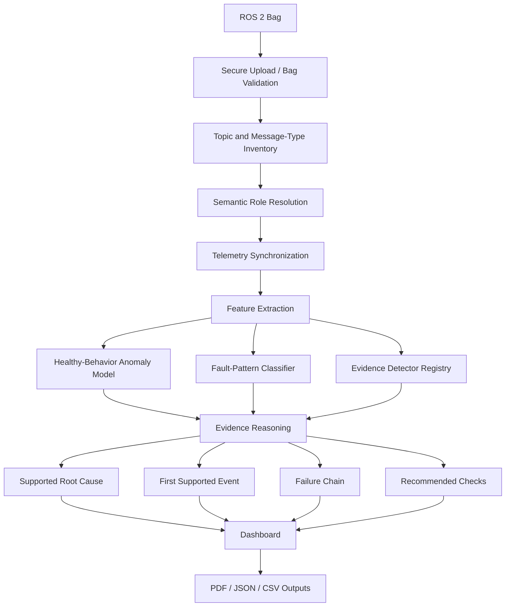

# RobotReplay Architecture

RobotReplay is structured as an evidence-first incident-investigation pipeline
for ROS 2 autonomous robot recordings.

## Design Goals

The architecture is built around five principles:

1. Accept real ROS 2 recordings without requiring a custom logging format.
2. Separate generic abnormality detection from root-cause diagnosis.
3. Ground supported diagnoses in interpretable robot telemetry.
4. Degrade safely when required signals are missing.
5. Keep the system modular so new robot subsystems and evidence signatures can
   be added independently.

## High-Level Pipeline



## 1. Secure Ingestion

`robotreplay/ingestion/upload.py`

The upload layer accepts a ZIP archive containing one supported ROS 2 bag and
enforces archive and extraction constraints before analysis.

The ingestion boundary is intentionally separate from diagnosis so malformed or
unsafe input never reaches the telemetry pipeline.

## 2. Bag Validation and Semantic Resolution

`robotreplay/ingestion/validation.py`

Validation inventories message types and topic names, then determines whether
the recording contains telemetry roles required by each analysis capability.

RobotReplay prefers common ROS topic names where available but does not rely
only on one fixed namespace. Message types and semantic roles are used to make
the pipeline more tolerant of unfamiliar topic naming.

Examples of diagnostic roles include:

- LiDAR scan stream,
- localization estimate,
- TF transforms,
- odometry,
- commanded velocity,
- wheel or joint feedback.

A capability is disabled when its required telemetry is unavailable.

## 3. Feature Extraction

`robotreplay/features/`

Raw asynchronous messages are transformed into synchronized feature windows.
The current baseline uses 0.2 s windows for the primary navigation feature
pipeline.

Feature extraction captures relationships across telemetry rather than treating
topics as independent logs.

Examples include:

- localization displacement,
- transform age and discontinuity,
- scan staleness and gap behavior,
- wheel direction relative to command,
- stream integrity indicators,
- robot motion consistency.

## 4. Healthy-Behavior Anomaly Cross-Check

`robotreplay/detectors/anomaly_model.py`

An Isolation Forest trained on healthy navigation telemetry provides a generic
abnormal-behavior signal.

Its purpose is to answer:

> Does this telemetry look meaningfully different from the learned healthy
> behavior?

It does **not** establish a root cause.

## 5. Fault-Pattern Statistical Cross-Check

`robotreplay/ml/`

A supervised Random Forest provides an independent statistical fault-pattern
cross-check for controlled fault families.

A feature-coverage gate prevents the classifier from being used when a
recording lacks sufficient compatible telemetry.

The classifier output is supporting evidence, not the final diagnosis.

## 6. ROS-Specific Evidence Detectors

`robotreplay/detectors/`

The detector registry currently contains evidence logic for:

- Localization Jump
- LiDAR Dropout
- LiDAR Stream Integrity Failure
- TF Delay / Discontinuity
- Wheel / Encoder Direction Mismatch

Each detector uses telemetry relationships relevant to the failure mechanism.

For example, Localization Jump requires a localization discontinuity correlated
with a transform correction rather than simply reacting to a large anomaly
score.

## 7. Evidence Reasoning

`robotreplay/services/analyzer.py`

The analyzer combines:

- available diagnostic capabilities,
- statistical cross-checks,
- detector evidence,
- temporal ordering.

It determines:

- mission health status,
- most likely supported cause,
- first supported diagnostic event,
- evidence strength,
- downstream propagation,
- recommended engineering checks.

A diagnosis is supported only when the corresponding evidence conditions are
established.

## 8. Unknown-Fault Handling

RobotReplay distinguishes between:

```text
Known supported signature
Unknown abnormal behavior
Insufficient diagnostic coverage
```

This is intentional. Forcing every abnormal recording into a known class would
make the system less trustworthy.

## 9. Presentation Layer

`dashboard/app.py`

The Streamlit application presents the investigation as an engineering workflow:

```text
Incident Summary
→ What Happened
→ Evidence
→ Telemetry
→ Failure Timeline
→ Recommended Actions
→ Incident Report
```

Model implementation details are kept secondary to evidence and engineering
interpretation.

## 10. Extensibility

A new failure signature should ideally add:

1. telemetry requirements,
2. feature definitions if needed,
3. an evidence detector,
4. controlled evaluation,
5. independent or external validation where possible,
6. recommended engineering checks,
7. regression coverage.

This allows diagnostic coverage to grow without turning the system into a
single opaque classifier.
